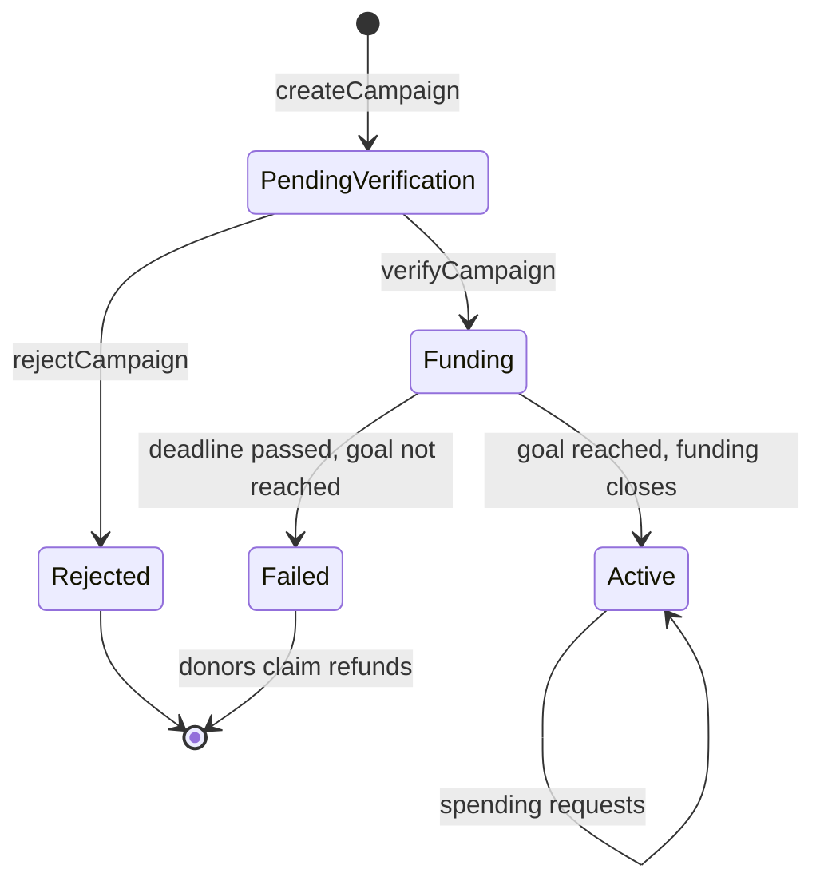
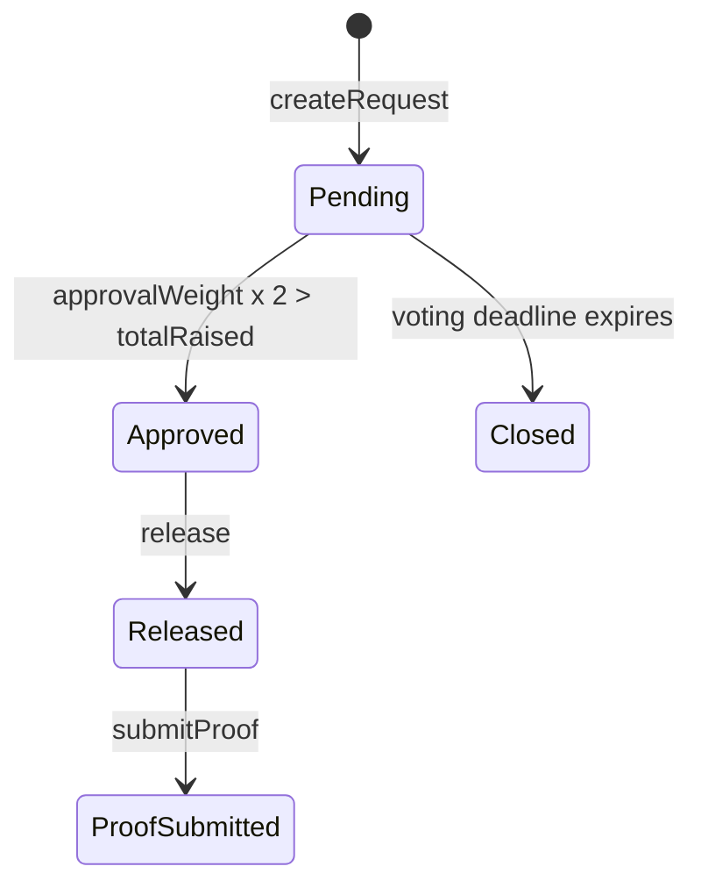

<div align="center">

# FundTrace

### Transparent funding. Verifiable spending.

**A blockchain fund-accountability platform that follows donated money from campaign verification to contributor-approved spending to proof of expenditure, with a public audit trail anyone can inspect without logging in.**


Built for **Versathon 2.0** (24-hour hackathon), Problem Statement **F4: Transparent Crowdfunding & Fund Ledger**.

 · [Demo Video & Slides](https://drive.google.com/drive/folders/1DlSpEKJ_hgrK7pnzfpWpgAeHnWrQxMvi?usp=sharing) · [Walkthrough](#demo-walkthrough)

</div>

---

## Table of Contents

- [The Problem](#the-problem)
- [The Solution](#the-solution)
- [How It Works](#how-it-works)
- [Key Features](#key-features)
- [Architecture](#architecture)
- [How Each Technology Is Used](#how-each-technology-is-used)
- [Governance: Snapshot Voting](#governance-snapshot-voting)
- [Proof Integrity](#proof-integrity)
- [Smart Contract Design](#smart-contract-design)
- [Security Considerations](#security-considerations)
- [Tech Stack](#tech-stack)
- [Getting Started](#getting-started)
- [Demo Walkthrough](#demo-walkthrough)
- [Testing](#testing)
- [Problem Statement Mapping](#problem-statement-mapping)
- [Design Decisions and Trade-offs](#design-decisions-and-trade-offs)
- [Limitations and Future Scope](#limitations-and-future-scope)
- [Originality and Attribution](#originality-and-attribution)
- [Team](#team)
- [License](#license)

---

## The Problem

Crowdfunding platforms are good at collecting money and weak at proving what happened to it afterwards.

- Donors cannot clearly track how raised funds are used.
- Spending records are scattered across spreadsheets, receipts and private databases.
- Contributors have little say in major spending decisions.
- Post-fundraising accountability is hard to verify independently.
- Edited or replaced evidence undermines trust in financial records.
- Campaign verification and fund utilization are usually handled as separate processes.

**Core question:** how can the complete journey of donated funds be made transparent, accountable and independently verifiable?

## The Solution

FundTrace connects campaign verification, fundraising, controlled spending, contributor approval, proof submission and public auditing in one workflow.

```
VERIFY CAMPAIGN → FUND → LOCK → REQUEST → VOTE → RELEASE → PROVE → CHECK PROOF → AUDIT
```

Donations are held by a smart contract, not by the campaign creator. Money leaves the contract in exactly two ways: an **approved release** to the request's visible recipient wallet, or a **refund** to donors of a failed campaign.

> FundTrace does not claim that locked funds or donor voting are new ideas on their own. Its contribution is combining verification, a closed funding phase, snapshot voting, a one-open-request rule, document hashes, proof deadlines and a public event ledger into a single accountability loop.

## How It Works

| Step | Action | What the contract enforces |
|---|---|---|
| 1 | **Create campaign**: creator submits metadata, goal and deadline | A canonical `metadataHash` is recorded on-chain |
| 2 | **Verify campaign**: an institutional verifier approves or rejects | Verifier cannot be the creator; verification only before the campaign deadline; only verified campaigns accept funds |
| 3 | **Fund**: contributors donate from their wallets | Before the deadline; creator address cannot donate |
| 4 | **Close funding**: the donation that reaches or exceeds the goal closes funding | No top-ups afterwards; raised may end above 100% |
| 5 | **Request spending**: creator submits purpose, amount, recipient, quote and `requestHash` | Amount ≤ available balance; only one open request; voting window within configured bounds |
| 6 | **Vote**: donors approve using their contribution as weight | One vote per donor; passes when `approvalWeight × 2 > totalRaised`; creator cannot vote |
| 7 | **Release**: anyone can trigger release once approved, even after the voting deadline | State updated before transfer; reentrancy guarded |
| 8 | **Submit proof**: creator submits the receipt hash | Within the fixed proof deadline; `receiptHash` recorded on-chain |
| 9 | **Check proof**: anyone re-uploads the file and the browser re-hashes it | Match means unchanged since submission |
| 10 | **Audit**: public ledger built from contract events | No login required |

### Campaign lifecycle



### Spending request lifecycle



`FAILED` and `PROOF OVERDUE` are computed statuses, not transactions. A campaign is failed once its deadline has passed without reaching the goal. A released request with no proof after the proof deadline is flagged in red on the dashboard.

A request is **open** while it is `PENDING`, `APPROVED`, or `RELEASED` without proof; an expired `PENDING` request is no longer open and can be closed by anyone. Only one request may be open at a time, so an unresolved request also blocks any new spending request.

## Key Features

- **Institution-verified campaigns**: approve or reject, with the verifier separated from the creator.
- **Locked-fund custody**: funds sit in the contract, not in a creator wallet.
- **Closed funding phase**: funding ends before spending starts, so voting weights are final and simple.
- **Contributor-weighted snapshot voting**: each donor's weight is their contribution; the denominator is the total raised.
- **One open request at a time**: prevents overlapping fund commitments.
- **Recipient wallet transparency**: every request shows exactly where the money goes.
- **Request and receipt hashing**: Keccak-256 commitments for the quote and the receipt.
- **Browser-side proof check**: upload a file, get an instant match or mismatch against the on-chain hash.
- **Proof deadline with overdue status**: missing evidence is visible, and blocks further spending.
- **Metadata integrity**: campaign story and details are hashed at creation and locked at verification.
- **Refunds**: donors reclaim their contribution if a campaign misses its goal.
- **Beneficiary Physical Delivery Attestation (`confirmDelivery`) [Versathon 2.0 Innovation]**: Solves "The Phantom Delivery" problem. Even after a vendor is paid and an invoice PDF is uploaded, subsequent spending requests are strictly blocked on-chain until the designated local school principal or hospital headmaster physically signs off on-chain that the physical goods arrived.
- **Project Dormancy & Dead-Man's Auto-Refund (`claimDormancyRefund`) [Versathon 2.0 Innovation]**: Solves "The Abandoned Student Project" problem. If student organizers graduate or abandon a project for 30+ days, contributors can pull back their exact proportional share of unspent escrow (`(donorDonation * remainingEscrow) / totalDonated`) directly from the smart contract without organizer approval.
- **Public event ledger**: every financial event with timestamp, transaction hash, donor and recipient addresses, no login.
- **Phase 2 Quotation System**: A dynamic workflow allowing creators to submit structured spending quotes against remaining campaign balances, which can be partially or fully sanctioned.
- **AI-Assisted Evaluation**: AI evaluates submitted quotations for risk and plausibility, serving as an advisory layer for donors before they sanction funds.
- **Creator Reliability Score**: An on-chain tracked reputation score for creators (0-100) that dynamically adjusts based on their history of claiming allocations and submitting timely proofs.
- **Portfolio Dashboards**: Dedicated transparent dashboards for both donors and creators to manage their active campaigns, track fund allocations, and sanction quotations.
- **Demo tooling**: local Hardhat network, pre-funded demo wallets and a one-command reset.

<!-- Add screenshots here once the UI is built:


-->

## Architecture

```text
                   FUNDTRACE
               Next.js Frontend
                      │
            ┌─────────┴─────────┐
            ↓                   ↓
         MetaMask             NestJS
       User Wallet         Backend / API
            │                   │
            │       ┌───────────┼───────────┐
            │       ↓           ↓           ↓
            │    Supabase    Business   Blockchain
            │   PostgreSQL    Logic       Service
            │    Storage                 ethers.js
            │                               │
            └───────────────┬───────────────┘
                            ↓
                    Solidity Contract
```

**Blockchain is the financial source of truth.** The contract holds money, authorization, votes, deadlines and hashes. The NestJS backend and Supabase only handle presentation data (title, story, images, original receipt files) and a cache of contract events, and anything important in them is committed on-chain by hash. The backend cannot move funds or change on-chain state, and the public ledger can be checked directly against the chain even if the backend is unavailable.

### Why Both Frontend and Backend Connect to the Blockchain

In FundTrace, both the client and server communicate with the Ethereum blockchain, but for fundamentally different purposes:

| Responsibility | Frontend (MetaMask / Client) | Backend (NestJS + ethers.js) |
|---|---|---|
| **Connection Type** | Signer (MetaMask browser extension) | Read-Only Provider (`JsonRpcProvider`) |
| **Private Keys & Custody** | Stored securely in user's browser (non-custodial) | **None** (backend never holds private keys or funds) |
| **Operations** | **Write / State Transitions**: `donate()`, `createCampaign()`, `approveRequest()`, `release()` | **Read-Only / Verification**: `metadataHash` / `receiptHash` verification, event caching |
| **Gas Costs** | Paid by the user in ETH | **Zero gas** (free off-chain RPC calls) |

- **Frontend (Write & Authorization):** Users maintain full custody of their funds. Any action that transfers ETH or changes contract state must be signed and authorized directly by the user's wallet via MetaMask.
- **Backend (Read & Tamper-Proof Verification):** The NestJS backend uses a read-only RPC provider to read on-chain anchor hashes (`metadataHash`, `receiptHash`) and compare them against off-chain records stored in Supabase. This guarantees that data served to users has not been altered or tampered with in the database. It also indexes blockchain events for rapid search, dashboard aggregation, and sorting without putting heavy query loads on the RPC node.

## How Each Technology Is Used

- **Solidity smart contract:** holds the funds and enforces the rules: campaign verification status, donations, locked funds, spending requests, contribution-weighted voting, releases, refunds, and request/receipt/metadata hashes. It emits the events behind the public ledger and is the source of truth for all financial state.
- **NestJS backend:** serves off-chain APIs: campaign content, receipt upload and storage (original bytes preserved), and an event indexer that caches contract events for fast queries. It cannot move funds or change on-chain state. Swagger documents every endpoint.
- **Supabase:** PostgreSQL stores campaign content and cached events. Storage keeps the original invoices, receipts and cover images.
- **Next.js:** the campaign dashboard, donation and voting interface, spending workflow, verifier panel, proof upload and check, and the public ledger.
- **MetaMask + ethers.js:** wallet connection and transaction signing, contract reads, and Keccak-256 hashing in the browser for proof and metadata checks.
- **Hardhat + OpenZeppelin:** local blockchain, tests and deployment, plus the audited `ReentrancyGuard`.

> **The blockchain holds the financial truth; databases hold only presentation data and caches.**

## Governance: Snapshot Voting

Funding closes before any spending request can be made, so each donor's final contribution is their voting weight and `totalRaised` is a fixed denominator. No checkpoints, no historical lookups, and late donors cannot influence existing requests.

**Rule:** a request passes when `approvalWeight × 2 > totalRaised`.

| Donor | Contribution | Share |
|---|---|---|
| Alice | 1.5 ETH | 46.9% |
| Bob | 1.0 ETH | 31.3% |
| Carol | 0.7 ETH | 21.9% |
| **Total raised** | **3.2 ETH** | |

| Approvers | Weight × 2 | vs 3.2 | Result |
|---|---|---|---|
| Alice alone | 3.0 | not greater | **Fails** |
| Alice + Bob | 5.0 | greater | **Passes** |
| Bob + Carol | 3.4 | greater | **Passes** |

The creator is blocked from donating and from voting **inside the contract**, not only in the UI.

## Proof Integrity

Two commitments bracket every spend:

- **`requestHash`**: hash of the original quote/estimate, recorded when the request is created, so donors vote on something concrete.
- **`receiptHash`**: hash of the actual receipt or invoice, recorded when proof is submitted after release.

The check runs in the browser, using the same algorithm the contract stores:

```ts
import { keccak256 } from "ethers";

async function hashFile(file: File): Promise<string> {
  const bytes = new Uint8Array(await file.arrayBuffer());
  return keccak256(bytes); // raw bytes, no compression or re-encoding
}

// compare hashFile(uploaded) with the receiptHash read from the contract
```

- **Match** → the file is unchanged since submission.
- **Mismatch** → the file differs from the submitted proof.

> **What this proves, and what it doesn't.** A hash proves a document has not changed since its hash was recorded. It does **not** prove the underlying receipt is genuine. FundTrace pairs the hash with verifier review and states this limit openly.

Original receipts are stored as untouched bytes in Supabase Storage. The backend performs no compression, image optimization or re-encoding on receipts, since any change to the bytes would break the hash check.

### Metadata integrity

Campaign details in Supabase (PostgreSQL) are serialized in a **canonical form** (sorted keys, deterministic serialization), hashed with Keccak-256, and committed on-chain at creation. The hash is locked when the campaign is verified. If the stored story is later altered, recomputing the hash no longer matches and the UI shows a metadata integrity warning. The funding goal lives only on-chain, so the two copies cannot disagree.

## Smart Contract Design

### Roles

| Role | Can do |
|---|---|
| **Creator** | Create campaigns, create spending requests, submit proof. Cannot donate or vote. |
| **Verifier** | Approve or reject campaigns. Cannot be the campaign creator. |
| **Donor** | Donate before the deadline, vote on requests, claim a refund if a campaign fails. |
| **Anyone** | Trigger `release` on an approved request, close an expired request, read the public ledger. |

### Core interface

| Function | Purpose |
|---|---|
| `createCampaign` | Register a campaign with goal, deadline and `metadataHash` |
| `verifyCampaign` / `rejectCampaign` | Verifier decision on a pending campaign |
| `donate` | Contribute to a verified campaign in the funding phase |
| `createRequest` | Open a spending request with recipient, amount and `requestHash` |
| `approveRequest` | Cast a contribution-weighted vote |
| `release` | Transfer funds to the recipient once the threshold is met |
| `closeExpiredRequest` | Close a request whose voting window has passed |
| `submitProof` | Record the `receiptHash` after release |
| `refund` | Withdraw a contribution from a failed campaign |

See `contracts/FundLedger.sol` for exact signatures and custom errors.

### Events (the source of the public ledger)

| Event | Emitted when |
|---|---|
| `CampaignCreated` | A campaign is registered (includes `metadataHash`) |
| `CampaignVerified` / `CampaignRejected` | The verifier decides |
| `Donated` | A contribution is received |
| `FundingClosed` | The goal is reached and funding ends |
| `RequestCreated` | A spending request is opened (includes `requestHash`) |
| `Approved` | A donor votes (includes weight) |
| `RequestApproved` | The approval threshold is crossed |
| `Released` | Funds are sent to the recipient |
| `RequestClosed` | A request expires without approval |
| `ProofSubmitted` | A `receiptHash` is recorded |
| `Refunded` | A donor withdraws from a failed campaign |

The ledger UI reads events starting from the **contract deployment block** rather than scanning the whole chain. Free RPC providers can limit event ranges, so the NestJS indexer caches events in Supabase for fast queries while the blockchain remains the source of truth.

## Security Considerations

| Concern | Mitigation |
|---|---|
| Reentrancy | State updated **before** external transfers, plus OpenZeppelin `ReentrancyGuard` |
| Creator self-dealing | Creator blocked from donating and voting **in Solidity** |
| Vote manipulation | Closed funding phase fixes weights and denominator |
| Overspending | Amount ≤ available balance; only one open request at a time |
| Stuck requests | Voting deadline with public `closeExpiredRequest` |
| Unbounded deadlines | Voting window must fall within min/max bounds set at deployment; proof window is a fixed period after release |
| Fake campaigns | Institutional verifier approval before any funding |
| Refund safety | Donors pull their own refund; a failed campaign accepts no more funding |
| Metadata tampering | `metadataHash` committed on creation and locked at verification |
| Backend or database compromise | The backend cannot move funds or change contract state; metadata and receipts are checked against on-chain hashes; the Supabase service key stays server-side |

This is a hackathon prototype and has **not** been independently audited.

## Tech Stack

| Layer | Technology |
|---|---|
| Frontend | Next.js, Tailwind CSS, Lucide React, Recharts, ethers.js v6 |
| Wallet | MetaMask, pre-funded demo wallets |
| Smart contracts | Solidity, Hardhat, OpenZeppelin `ReentrancyGuard` |
| Backend | NestJS (REST API, Swagger docs, Multer uploads, event indexer) |
| Database and storage | Supabase: PostgreSQL for campaign content and cached events; Storage for original receipts and cover images |
| Hashing | Keccak-256 via ethers.js (requests, receipts, metadata) |
| Testing | Hardhat, Chai |
| Networks | Local Hardhat (primary demo), Ethereum Sepolia (public backup) |

## Getting Started

### Prerequisites

- Node.js 22 or newer
- npm
- A Supabase project (project URL and service-role key)
- MetaMask (optional: demo mode signs with pre-funded local accounts)

### Install

```bash
git clone <your-repo-url>
cd fundtrace
npm install
cp .env.example .env
```

### Project structure (suggested)

```
fundtrace/
├── contracts/      FundLedger.sol
├── test/           Hardhat tests
├── scripts/        deploy, demo:reset, demo:live
├── deployments/    deployed address and block per network
├── backend/        NestJS backend (Swagger, uploads, event indexer)
├── src/            Next.js frontend services and UI
└── demo-files/     quotes, invoices, tampered invoice
```

Adjust to match the real repository layout.

### Environment variables

| Variable | Description |
|---|---|
| `SUPABASE_URL` | Supabase project URL |
| `SUPABASE_SERVICE_ROLE_KEY` | Service-role key, **server-side only** |
| `SUPABASE_STORAGE_BUCKET` | Bucket for receipts and cover images |
| `API_PORT` | NestJS API port (for example `4000`) |
| `NEXT_PUBLIC_API_URL` | Base URL of the NestJS API |
| `NEXT_PUBLIC_CHAIN_ID` | `31337` for local Hardhat, `11155111` for Sepolia |
| `NEXT_PUBLIC_RPC_URL` | RPC endpoint (`http://127.0.0.1:8545` locally) |
| `SEPOLIA_RPC_URL` | Sepolia RPC URL (backup deployment only) |
| `DEPLOYER_PRIVATE_KEY` | **Test-only** key for Sepolia deploys. Never commit a real key. |

The contract address and deployment block are written by the deploy script to `deployments/<network>.json` and read by the app, so a redeploy does not require restarting the dev server (`NEXT_PUBLIC_*` variables are only read at startup).

`SUPABASE_SERVICE_ROLE_KEY` is used only by the NestJS server. Never expose it to the frontend or commit it to git.

### Run locally (primary demo setup)

```bash
# Terminal 1: local blockchain
npx hardhat node

# Terminal 2: deploy contracts and seed the demo (chain and Supabase)
npm run demo:reset

# Terminal 3: NestJS API
npm run backend:dev

# Terminal 4: web app
npm run dev
```

Open `http://localhost:3000`. To use MetaMask instead of demo mode, add a network with RPC `http://127.0.0.1:8545`, chain ID `31337`, and import one of the pre-funded Hardhat accounts. The NestJS app serves Swagger API docs (for example at `http://localhost:4000/api/docs`).

### Public backup deployment (Sepolia)

```bash
npx hardhat run scripts/deploy.js --network sepolia
```

Have Sepolia test ETH ready before the event; faucets can be slow. Test event queries early against your RPC provider.

### Useful scripts

| Command | What it does |
|---|---|
| `npx hardhat test` | Run the contract test suite |
| `npm run demo:reset` | Reset the local chain and the Supabase demo data (tables and storage), deploy, seed campaigns (with matching `metadataHash`), donations, requests and proof files, write deployment info. Requires `npx hardhat node` to be running |
| `npm run demo:live` | Create the live spending request with a fresh 10+ minute voting window |
| `npm run backend:dev` | Start the NestJS API |
| `npm run dev` | Start the Next.js app |

## Demo Walkthrough

### Seeded data (all values in test ETH)

**Main campaign: Build Rural STEM Lab**

| Metric | Value |
|---|---|
| Goal | 3.0 ETH |
| Raised | 3.2 ETH (**107% funded**) |
| Released | 1.2 ETH |
| Remaining | 2.0 ETH |

- **Request #01**: 50 Arduino boards, 1.2 ETH, `RELEASED`, proof `SUBMITTED` (the completed accountability path).
- **Request #02**: laboratory equipment, 0.5 ETH, `PENDING`, created live by `npm run demo:live`.
- **Verifier demo campaign**: a separate campaign in `PENDING VERIFICATION` for the approve/reject demo.
- **Overdue demo campaign**: a small campaign with a `RELEASED` request whose proof deadline has passed, showing **PROOF OVERDUE** and a blocked new request.

Dashboard figures use test ETH throughout. No real money is involved. If the backend is unreachable, the public ledger still reads directly from the contract; keep a recorded run of the demo as a fallback.

### Three-minute judge flow

1. **Verify.** In the verifier panel, approve the pending campaign. Only verified campaigns accept donations.
2. **Fund and lock.** View the main campaign: funds are locked in the contract, 107% funded, funding closed.
3. **Vote.** Open Request #02. Alice votes (46.9%, not enough), then Bob votes (78.1%). The request flips to `APPROVED`.
4. **Release.** Trigger release. The recipient wallet shown on the card receives the funds.
5. **Prove.** Open Request #01 and upload the original invoice. The browser hashes it: `MATCH: file unchanged`.
6. **Tamper test.** Upload the edited invoice. **`VERIFICATION FAILED`**: the document does not match the proof recorded on-chain.
7. **Hold them accountable.** Open the overdue campaign: red `PROOF OVERDUE`, and a new request is blocked.
8. **Audit.** Open the public ledger, no login: every event with timestamp, transaction hash and addresses.
9. **Physical Delivery Attestation (Phantom Delivery Defense).** Switch to Beneficiary role (Principal Sharma) and confirm physical receipt. Subsequent spending requests are blocked on-chain until local ground-truth delivery is attested!
10. **Dead-Man's Dormancy Auto-Refund (Abandoned Student Project Defense).** If a project goes dormant for 30+ days, contributors Alice & Bob can reclaim their unspent escrow share proportionally without organizer approval.

Demo files live in `demo-files/`: the quotes for Request #01 and Request #02, the original invoice, and a pre-made tampered invoice (created and tested well before judging).

## Testing

Run `npx hardhat test`. The suite contains **63 automated unit tests** (100% pass rate) covering the complete rule verification suite:

- Donations update totals, and only verified campaigns in the funding phase accept them
- Creator cannot donate or vote
- Non-donors cannot vote; no double voting
- Snapshot threshold: passes above 50% of total raised, fails at or below
- Release blocked below threshold, works at threshold, cannot be repeated
- Request amount cannot exceed the available balance; only one open request
- Expired voting closes the request (time travel with `evm_increaseTime`)
- Proof deadline and overdue status
- Refunds after a failed campaign, and not before
- Verifier cannot be the creator; rejected campaigns cannot be funded
- **Beneficiary Delivery Attestation rules**: Ground-truth confirmation, non-beneficiary rejection, and phantom delivery spending blocks
- **Dormancy Auto-Refund rules**: 30-day inactivity detection, exact proportional share calculation, and double-claim prevention

## Problem Statement Mapping

**Versathon 2.0, F4: Transparent Crowdfunding & Fund Ledger.**

| Suggested scope | FundTrace |
|---|---|
| Campaign/project creation | Campaign creation with verified metadata and institutional approval |
| Contributor and donation records | On-chain `Donated` events with donor address and amount |
| Fund allocation workflow | Spending requests, contributor-weighted voting, controlled release |
| Public utilization dashboard | Campaign dashboard and no-login public ledger |
| Blockchain or tamper-evident audit trail | Contract events plus request, receipt and metadata hashes |
| **Real-world edge case #1 (Phantom Delivery)** | **Beneficiary Physical Delivery Attestation (`confirmDelivery`)** |
| **Real-world edge case #2 (Abandoned Student Project)** | **Dead-Man's Auto-Refund (`claimDormancyRefund`)** |

## Design Decisions and Trade-offs

- **Funding closes before spending.** This keeps voting weights final and the contract simple. The trade-off is that no top-ups are possible after the goal is reached.
- **One open request at a time.** This removes overlapping commitments. The trade-off is slower spending for campaigns with many small expenses.
- **Proof status is checked in the UI, not stored as a "verified" state.** A hash match is an honest claim about file integrity, so the contract stops at `PROOF_SUBMITTED`.
- **Overdue is computed on read.** Contracts cannot run on their own, so the status is derived from timestamps.
- **ETH-denominated prototype.** Everything shown is test ETH. A production system would settle through compliant payment rails or stablecoins.
- **The backend is a content and cache layer, not a trust layer.** It stores presentation data and cached events; every important claim is anchored on-chain by hash.
- **NestJS + Supabase.** NestJS gives a structured API with Swagger docs that are easy to test; Supabase provides managed PostgreSQL and file storage. The trade-off is a hosted dependency (see limitations).
- **No DAO, token or NFT layer.** The goal is a focused accountability loop, not a governance framework.

## Limitations and Future Scope

**Known limitations**

- **Creator Sybil:** another wallet could contribute on the creator's behalf. Mitigated by verified campaigns and public donor addresses, not eliminated.
- **Single verifier:** the prototype trusts one institution.
- **Whale voting:** contribution-weighted voting gives larger donors more influence.
- **Receipt authenticity:** hashes detect changes, not fake receipts.
- **Creator abandonment:** remaining funds may need a future recovery mechanism.
- **Test ETH only:** prototype funds have no monetary value.
- **Regulation:** a real deployment would require appropriate payment, crowdfunding and crypto compliance.
- **Hosted backend dependency:** off-chain content and cached events depend on Supabase availability. On-chain state and hashes remain verifiable directly from the contract.
- **Not audited.**

**Roadmap**

- Multi-verifier approval and multisig governance
- Quorum, per-donor voting caps or quadratic voting
- Stablecoin and payment-gateway integration
- Abandonment/recovery mechanism for undelivered proof
- Independent smart-contract audit
- AI-assisted receipt plausibility checks as an advisory layer (never a substitute for verifier review)
- Institutional dashboards, audit exports and compliance workflows

## Originality and Attribution

- All application and smart-contract code in this repository was written during Versathon 2.0; the commit history reflects the development process.
- The architecture was planned in advance; no code from that planning was carried into the repository.
- Third-party libraries (OpenZeppelin Contracts, ethers.js, Hardhat, Next.js, NestJS, Supabase and others) are used as dependencies; see `package.json`. Any adapted snippet is credited with a link in a code comment.
- AI assistance: _state here whether AI tools were used and how, if the organizers permit it._

## Team

| Team StackBlaze |

| Tharun Rai | 
| Anoop | 
| Pranathi R Shetty | 

Built at **Versathon 2.0**.

## License

Released under the [MIT License](LICENSE).

## Acknowledgements

Ethereum, Solidity, OpenZeppelin Contracts, Hardhat, ethers.js, Next.js, NestJS, Supabase and the Versathon 2.0 organizers.
